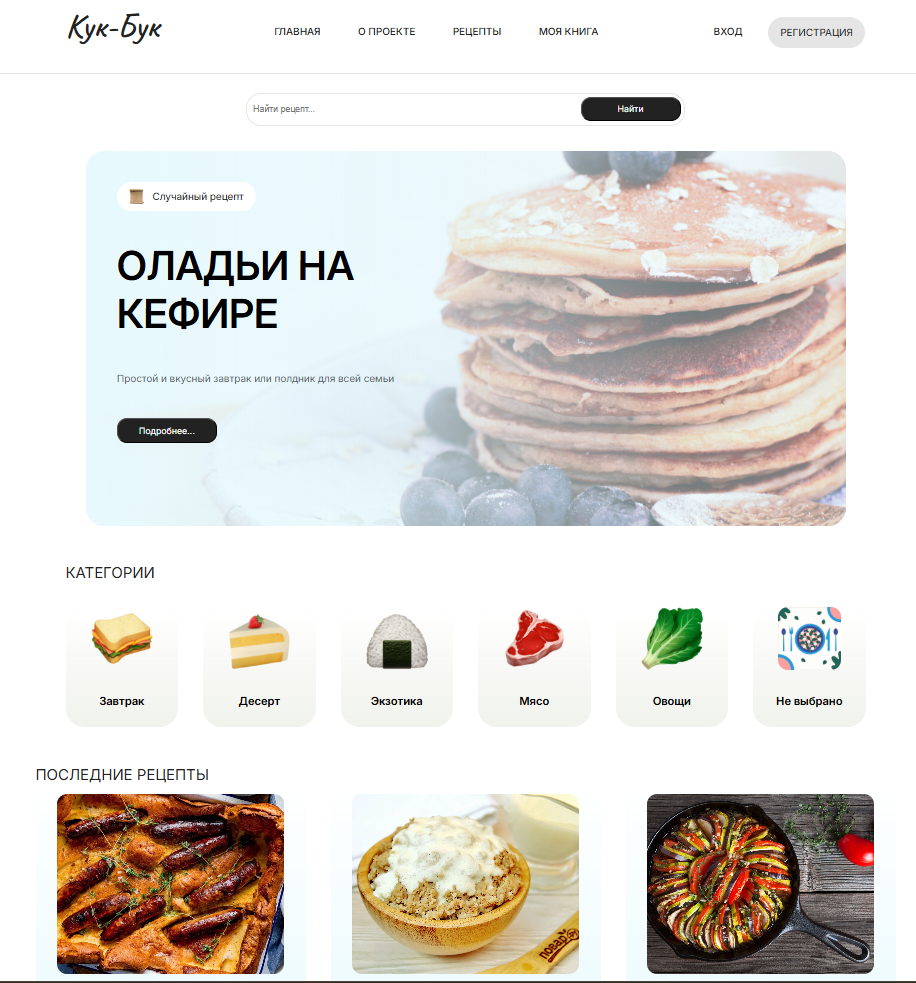
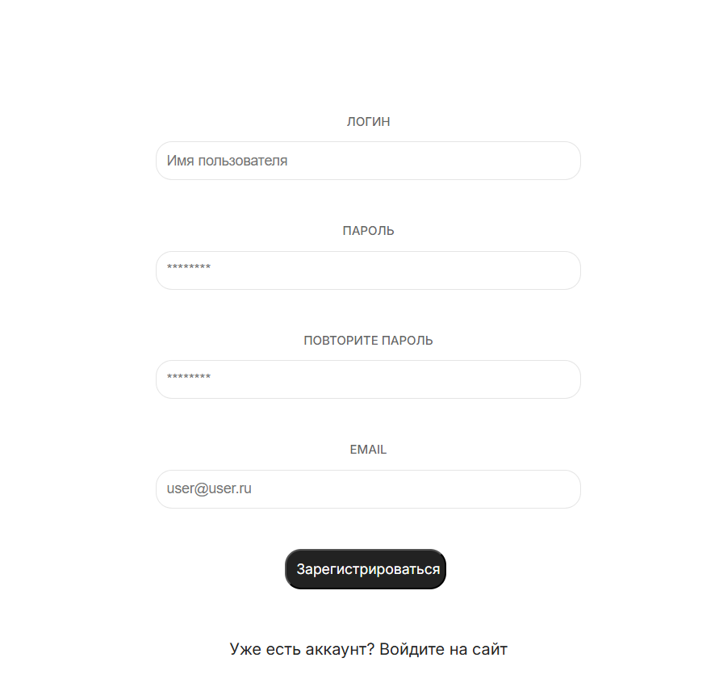
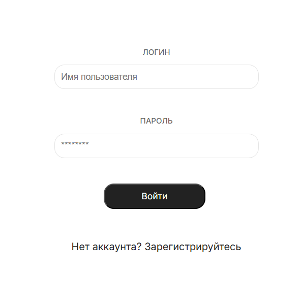
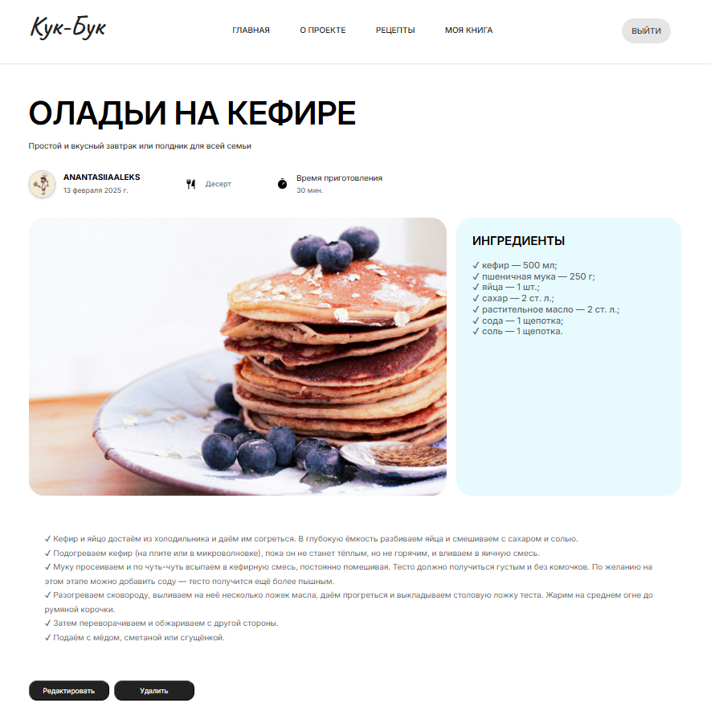
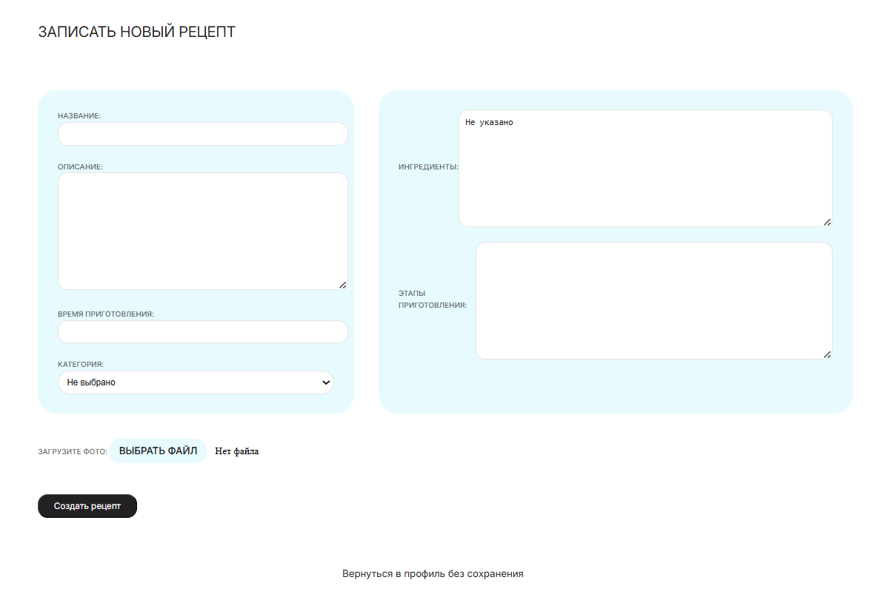
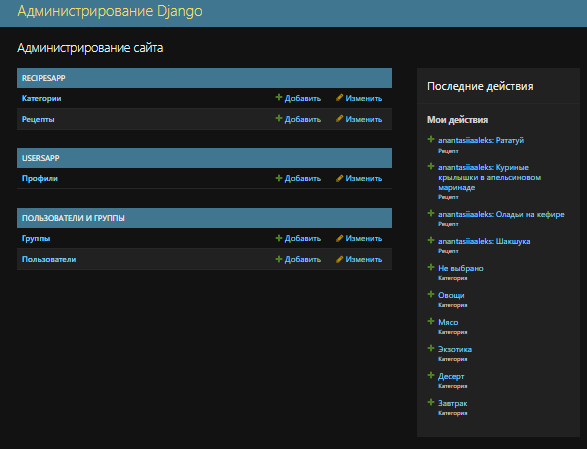
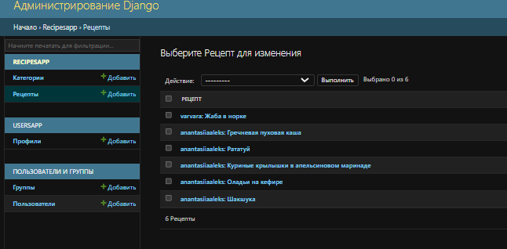

# Cookbook


Сайт-блог - электронная кулинарная книга. Позволяет просматривать кулинарные рецепты, записанные авторизованными пользователями.

Создан с помощью:
- Python 🐍
- Django 🎸
- HTML & CSS 🌈
- MYSQL

Рабочая версия проекта размещена на [Pythonanywhere.com](https://anantasiiaaleks.pythonanywhere.com/)

## Как запустить проект:
(с использованием SQLite)

1. Клонируйте репозиторий
``` bash
  git clone https://github.com/AnantasiiaAleks/cookbook.git
```
2. Активируйте виртуальное окружение, если не сделали этого раньше и установите необходимые библиотеки и зависимости
```bash
    pip install requirements.txt
```
3. В файле settings.py измените настройки БД
```python
DATABASES = {
    'default': {
        'ENGINE': 'django.db.backends.sqlite3',
        'NAME': os.path.join(BASE_DIR, 'db.sqlite3'),
    }
}
```
4. Запустите миграции
```bash
    python manage.py makemigrations
    python manage.py migrate
```
5. Запустите сервер
```bash
    python manage.py runserver
```
6. Для доступа в админ-панель необходимо создать суперпользователя.
```bash
    python manage.py createsuperuser
```

## Скриншоты и описание

### Главная страница


На главной странице, кроме стандартных хедера и футера с навигацией, реализовано:
- поиск по названию рецепта;
- баннер со случайным рецептом;
- перечень категорий (при клике - подгужается страница с рецептами, относящимися к категории);
- последние записанные 6 рецептов(краткая версия: картинка, название, описание)

### Регистрация пользователя


Форма регистрации реализовано наследованием от ``UserCreationForm``. В классе реализованы функции валидации:
- ```def clean_username(self)``` - проверяет уникальность имени пользователя;
- ```def clean_email(self):``` - кроме стандартной проверки на формат записи, проверяет уникальность введенного email;
- ```def password2_clean(self):``` - стандартная валидация плюс проверка на идентичность паролей в полях ввода и повтора.

### Вход в аккаунт


Стандартный вход в аккаунт. Реализовано в представлении ``def login_view(request)`` приложения usersapp.
В случае успешного входа открывает страницу профиля, где перечисляются карточки с собственными рецептами.


### Страница всех рецептов


Каждая карточка - является ссылкой на страницу с описанием конкретного рецепта.

### Страница детального описания рецепта


При клике на имя автора рецепта открывается страница со списком всех записанных им рецептов.
Для авторизованного пользователя-автора рецепта доступны кнопки редактирования и удаления.

### Страница добавления рецепта


Стандартная форма добавления новой записи. 
Кроме того, кастомизовано сохранение загружаемого изображения (каждое изображение сохраняется в директорию media/recipes/_category_name_, при этом изменяется наименование изображения в соответствии с названием рецепта):
```python
    def save(self, *args, **kwargs):
        """
        Сохранение в БД рецепта.
        Формирование имени загружаемого пользователем изображения
        :param args:
        :param kwargs:
        """
        self.title_lower = self.title.lower() if self.title else None
        if self.category and self.title:
            category_name = translit(self.category.name)
            if self.photo:
                file_extension = os.path.splitext(self.photo.name)[1]
                translit_title = translit(self.title)
                new_file_name = f"{translit_title}{file_extension}"
                self.photo.name = f"{category_name}/{new_file_name}"
            else:
                if not self.pk:
                    self.photo = 'recipes/default_recipe.jpg'

        super().save(*args, **kwargs)
```

Функция ``translit()`` "переводит" кириллическое название рецепта в транслит:
```python
def translit(text):
    translit_dict = {
        'а': 'a', 'б': 'b', 'в': 'v', 'г': 'g', 'д': 'd',
        'е': 'e', 'ё': 'yo', 'ж': 'zh', 'з': 'z', 'и': 'i',
        'й': 'y', 'к': 'k', 'л': 'l', 'м': 'm', 'н': 'n',
        'о': 'o', 'п': 'p', 'р': 'r', 'с': 's', 'т': 't',
        'у': 'u', 'ф': 'f', 'х': 'kh', 'ц': 'ts', 'ч': 'ch',
        'ш': 'sh', 'щ': 'shch', 'ъ': '', 'ы': 'y', 'ь': '',
        'э': 'e', 'ю': 'yu', 'я': 'ya', ' ': '_'
    }
    return ''.join(translit_dict.get(char, char) for char in text.lower())
```

### Панель администратора




## Будущие реализации
- добавление адаптива для разных разрешений (на текущий момент шаблон оптимизорован под разрешение 1280 и выше);
- расширение вариантов поиска рецепта (сейчас - только по названию или части названия рецепта);
- расширение формы создания рецепта (добавление более, чем одного изображения, функция прикрепления видео, возможность поэтапного ввода шагов приготовления);
- добавление "Избранное";
- добавление рейтинга рецепта.

## Благодарности и источники
Основа шаблона сайта - [макет Webflow-recipe-template](https://www.flowbase.co/clone/webflow-recipe-template)
Отдельное спасибо лектору Алексею Петренко
